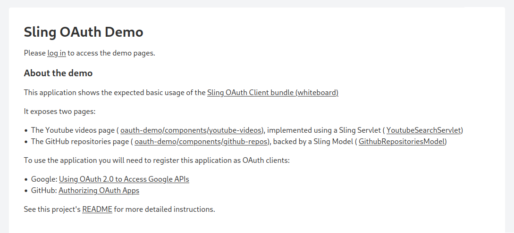

# Apache Sling OAuth client sample

This sample application demonstrates how the [Apache Sling OAuth client](https://github.com/apache/sling-org-apache-sling-auth-oauth-client)
bundle can be used. It does so by connecting the Google Cloud APIs using Open ID Connect and to
the GitHub APIs using OAuth 2.0.

The application does not perform any sensitive operation or perform write actions using the
tokens it retrieves on behalf of the user.

## Building

The build requires Java 17.

First of all, you need to install a SNAPSHOT build of the OAuth client bundle that contains the latest fixes.

```
$ git clone https://github.com/apache/sling-org-apache-sling-auth-oauth-client
$ cd sling-org-apache-sling-auth-oauth-client
$ mvn clean install
```

Then you can build the local application using

```
$ git clone https://github.com/apache/sling-samples
$ cd oauth
$ mvn clean install
```

## Configuring

> [!WARNING]
> Do not commit the client ids and client secrets referenced below to Git, they are sensitive information.

### Google Cloud APIs

Create a new Google Cloud project and generate client credentials for it. Follow the documentation from
https://developers.google.com/identity/protocols/oauth2 and ensure that the application has access to
the Youtube APIs using the `https://www.googleapis.com/auth/youtube.force-ssl` scope.

Obtain the client id and client secret and save them under

- `launcher/secrets/google/clientId`
- `launcher/secrets/google/clientSecret`

### GitHub

Create a new GitHub OAuth app and generate client credentials for it. Follow the documentation from 
https://docs.github.com/en/apps/oauth-apps/building-oauth-apps/authorizing-oauth-apps . No special
permissions are needed.

Obtain the client id and client secret and save them under

- `launcher/secrets/github/clientId`
- `launcher/secrets/github/clientSecret`

### Spotify

Create a new Spotify Developer app and generate client credentials for it. Follow the documentation from
https://developer.spotify.com/documentation/web-api . No special permissions are needed.

Obtain the client id and client secret and save them under

- `launcher/secrets/spotify/clientId`
- `launcher/secrets/spotify/clientSecret`


## Launching

Change to the launcher directory and run `make run`.  This will check if the required secrets are
defined, generate secrets on the fly for encryption and lanuch the application. If you do not have `automake`
installed, see [Launching without a makefile](#launching-without-a-makefile) at the end of this
document.

Once the application starts up you can access the entry point at http://localhost:8080/oauth-demo.html.
There will be instructions for logging in and links to access the available pages.



### Reducing number of login prompts

For demo purposes the two connections are configured to always prompt the user to log in or select
an account. The number login prompts can be reduced by removing the "prompt=..." values from the
`additionalAuthorizationParameters` configuration values defined in [launcher/src/main/features/launcher.json](launcher/src/main/features/launcher.json).

The property can be removed completely if it is empty.

### Launching without a Makefile

If you do not have make installed you can also manually run following commands:

To initialise the encryption secrets, only needed once:

```
$ openssl rand  -hex 32 > secrets/encrypt/password
```

To run the application:

```
$ target/dependency/org.apache.sling.feature.launcher/bin/launcher \
    -f target/slingfeature-tmp/feature-app.json \
    -D org.apache.felix.configadmin.plugin.interpolation.secretsdir=secrets
```
